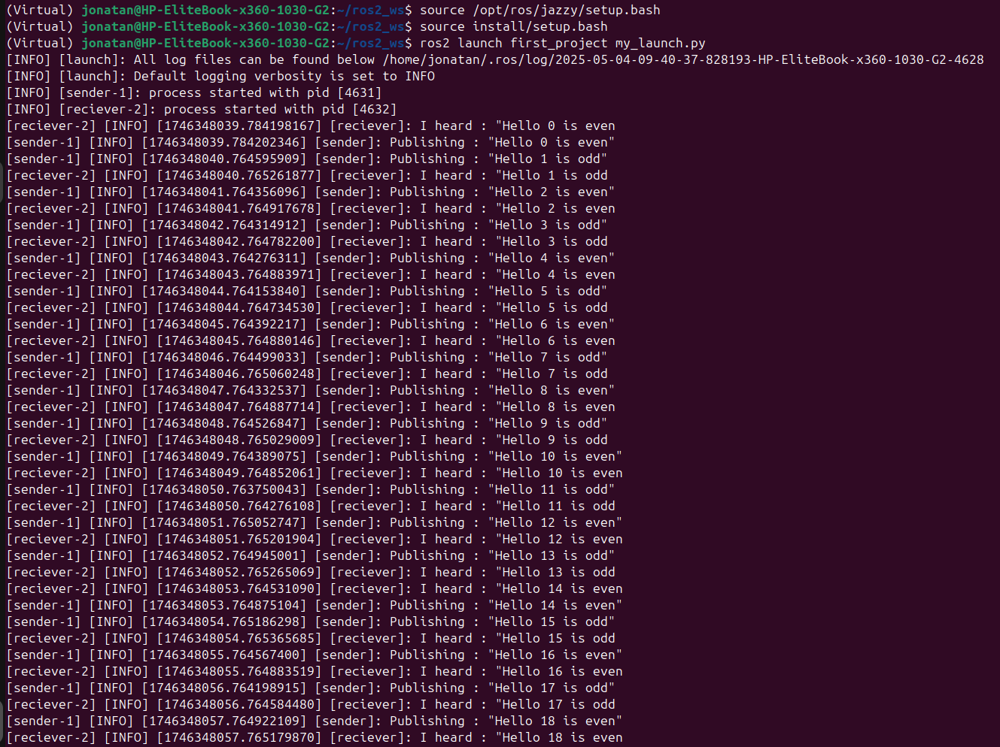
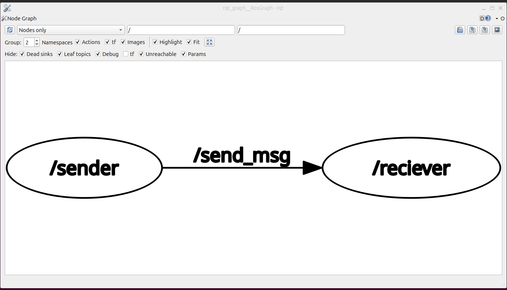

# Launch files in ROS2 Jazzy Jalisco 

*Overview*

> As we create more complex systems with more and more nodes running simultaneously, opening terminals and reentering configuration details becomes tedious. Launch files allow you to start up and configure a number of executables containing ROS2 nodes  simultaneously.

## What is a Launch file ?

A launch file is a powerful tool that launches multiple nodes in one single file. It is a configuration file used to start and manage nodes.


### Benefits of a Launch file

1. **Simplifies Complex Startups**
    You can start multiple nodes or processes with a single command, avoiding manual startup of each component.
2. **Centralized Configuration**
    Parameters (e.g. file paths, sensor settings, robot configurations) can be set in the launch file, keeping them all in one place for easier management.
3. **Reusable and Modular**
    Launch files can include other launch files, promoting modularity. This makes it easy to share and reuse configurations across projects or teams.    

### How to build a Launch file in ROS2 
We will take the first_project as an example on how to build launch files.
Makesure you have installed ros2 jazzy jalisco properly.
To verify if it is properly installed.
```
echo $ROS_DISTRO
```
the result must be : **jazzy**

i. **Build the ROS2 workspace**
```
source /opt/ros/jazzy/setup.bash
mkdir -p ~/ros2_ws/src
cd ~/ros2_ws
colcon build
```

ii. **Create a project**
```
cd ~/ros2_ws/src
source /opt/ros/jazzy/setup.bash  
ros2 pkg create --build-type ament_python --license Apache-2.0 first_project
```
Then create your nodes, we will create two nodes one sender node and one reciever node.


iii. **Configuration of setup.py**
In this file, you will create entry points to facilitate executions of each node.
the entry point refers to the starting point of an executable or a node, where the ROS 2 system begins its execution.

For ROS2 nodes, the entry point is typically the **main()** function of the executable, which is responsible for initializing the ROS 2 system, creating a node, and then running the node's functionality.

Here is how to make the entry point in the setup.py file :
```
 entry_points={
        'console_scripts': [
            'sender=first_project.publish_node:main',
            'reciever=first_project.subscriber_node:main',
        ],
    },
```
iv. **Creating the launch file**
```
cd ~/ros2_ws/src/first_project
mkdir launch 
cd launch 
touch my_launch.py # your launch file must have this path  *_launch.py
```
In this file, you have to add a node. You will have to provide :
- the package inwhich the node is
- The entry point of the node 
- The name of the node 
NB: the name arguement renames the node already named in the **.py**  file of each node during construction.
*If you launch the nodes without launch files they will have different names of nodes ie they will have the names passed in the node constructor*  (see ***/ressources*** directory ).
```
  launch_ros.actions.Node(
         package='first_project',
         executable='reciever',
         name='reciever'
     ),
```

v. **Building the project**
```
colcon build --packages-select first_project
```
vi. **Running the project**
In a new terminal :
```
cd ~/ros2_ws
source /opt/ros/jazzy/setup.bash
source install/setup.bash
ros2 launch first_project my_launch.py
```

### RESULTS

#### RQT VISUALISATION
*In a new terminal, execute the following commands*
```
source /opt/ros/jazzy/setup.bash
rqt_graph
```



## 📄 License
See the [LICENSE](LICENSE) file for more details.